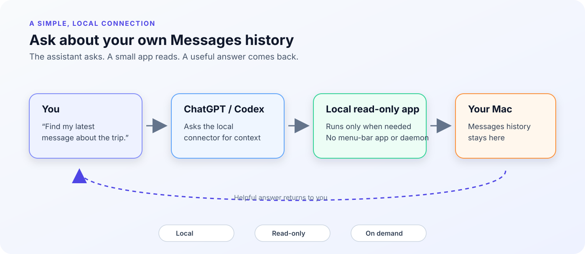
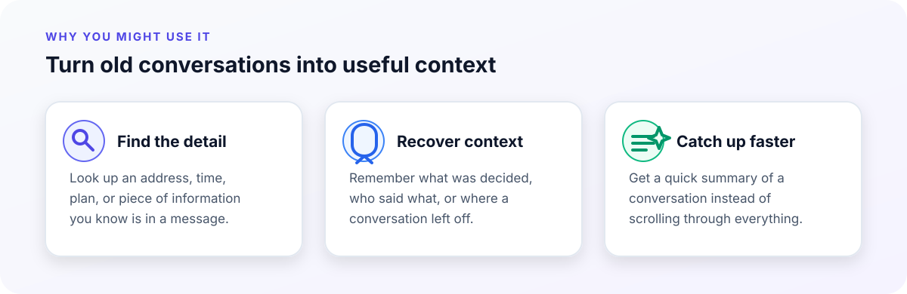
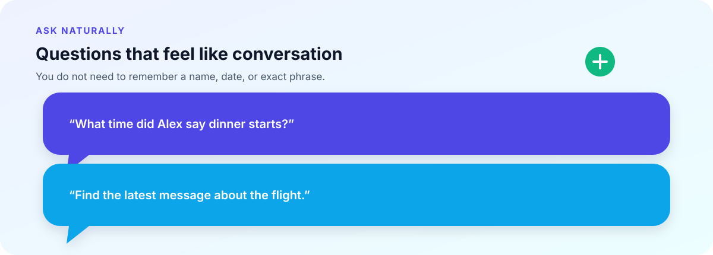
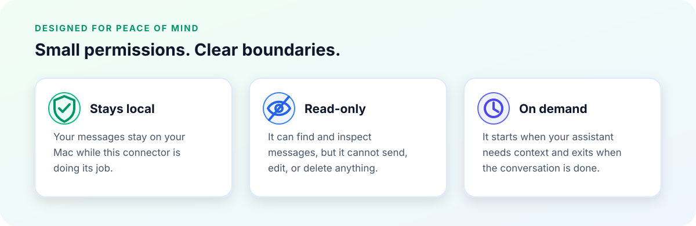
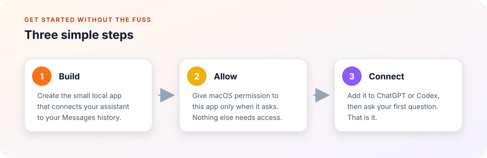
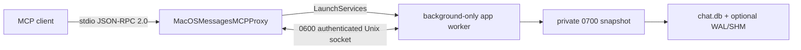

# macOS Messages MCP

<p align="center">
  
</p>

<p align="center">
  <strong>Your Messages history, ready when you need it.</strong><br>
  Ask ChatGPT or Codex about conversations already on your Mac - without turning your computer into an always-on automation box.
</p>

## Why you'd use it

Maybe you remember that someone sent you an address, a time, or a plan - but not where it was. This gives your assistant a simple way to look through the message history you already have and bring back the useful bit.

<p align="center">
  
</p>

## What you can ask

<p align="center">
  
</p>

- “What time did Alex say dinner starts?”
- “Find the last message about the flight.”
- “What was the address someone sent me yesterday?”
- “Catch me up on this conversation.”

You ask normally. The connector handles the lookup quietly in the background and returns the relevant context to your assistant.

## Private by design

<p align="center">
  
</p>

Your messages stay on your Mac while this connector is working. It cannot send, edit, or delete messages, and it does not need another app sitting in your menu bar all day.

## Get started

<p align="center">
  
</p>

1. Build the small local app.
2. Give macOS permission to that app only.
3. Add it to ChatGPT or Codex and ask a question.

The exact setup commands, permission notes, and client configuration are in the [Technical details](#technical-details) section below.

## Technical details

<details>
<summary>Show architecture, tools, permissions, testing, and developer notes</summary>

### What it can do

| Tool | Description |
| --- | --- |
| `doctor` | Checks that the Messages database is present, readable, read-only, query-only, and compatible with the expected schema. |
| `list_chats` | Lists chats by recent activity with identifiers and message counts. |
| `search_messages` | Searches plain-text message bodies for a case-insensitive substring. SQL wildcard characters are escaped. |
| `recent_messages` | Returns the newest messages across chats. |
| `get_chat_messages` | Returns messages for one chat identifier, oldest first. |
| `message_stats` | Returns aggregate counts and oldest/newest message dates without returning message bodies. |

Limits are bounded by the server. List-like tools accept a maximum of 500 records per request and default to 50.

### What it intentionally cannot do

This is an inspection server, not a messaging automation server. It has no tools for:

- sending or composing messages;
- editing or deleting messages or chats;
- changing read status;
- reading attachments or exporting attachment contents;
- opening arbitrary files or directories;
- running arbitrary SQL;
- connecting to the network;
- controlling the Messages application through simulated UI actions.

Modern Messages data can store text in either the ordinary `text` column or an archived `attributedBody` blob. The server uses a conservative extractor for common archived text when returning messages, but `search_messages` searches only the plain `text` column in v1.

### Architecture



#### A typical request

```text
+---------------------------+
| You ask ChatGPT / Codex:  |
| "Find my latest message"  |
+-------------+-------------+
              |
              | MCP tool call over stdio
              v
+---------------------------+
| MacOSMessagesMCPProxy     |
| local + on demand         |
+-------------+-------------+
              |
              | authenticated Unix socket
              v
+---------------------------+
| MacOSMessagesMCP.app      |
| native Swift worker       |
| Full Disk Access here only|
+-------------+-------------+
              |
              | read-only snapshot
              v
+---------------------------+
| ~/Library/Messages        |
| chat.db (+ WAL / SHM)     |
+-------------+-------------+
              |
              | structured results
              v
+---------------------------+
| Back to the assistant     |
| read-only + no daemon     |
+---------------------------+
```

The proxy is the executable an MCP client should launch. It:

1. Creates a private Unix socket with a random name and restrictive permissions.
2. Generates a one-use authentication token.
3. Starts the app bundle through `/usr/bin/open` with worker-only arguments.
4. Verifies the worker's token handshake.
5. Relays MCP bytes between the client's stdio pipes and the worker.
6. Shuts down when the client closes its pipe.

The worker performs the database work. When SQLite WAL sidecars are present, it copies `chat.db`, `chat.db-wal`, and `chat.db-shm` into a private temporary directory and queries that snapshot. This avoids opening the live database in place while Messages may be writing to it. If a stable snapshot cannot be obtained, the request fails rather than falling back to an unsafe live read.

The MCP transport is newline-delimited JSON-RPC 2.0 over stdio. The server handles `initialize`, `ping`, `tools/list`, and `tools/call`; notifications receive no response, as required by the protocol flow.

### Requirements

- macOS 13 or newer;
- Swift 5.9 or newer, normally provided by Xcode Command Line Tools;
- a local Messages database at the standard macOS location;
- Full Disk Access granted to the built app bundle if macOS blocks access to `~/Library/Messages`.

No Node.js, Python, Homebrew package, database server, or third-party Swift dependency is required.

### Build the app

Clone the repository, then run:

```sh
cd macos-messages-mcp
./scripts/build-app.sh
```

The script:

1. Builds the worker and proxy in release mode.
2. Creates `outputs/MacOSMessagesMCP.app`.
3. Places the worker and proxy inside the app bundle.
4. Sets `LSUIElement` so the app has no normal window or menu-bar item.
5. Applies an ad-hoc local signature.
6. Verifies the completed bundle with `codesign --verify --deep --strict`.

The ad-hoc signature is intentionally suitable for local development, not distribution. Replacing the app with a rebuilt binary can cause macOS to require the app to be removed and added again under Full Disk Access.

### Grant the minimum macOS permission

1. Build the app.
2. Open **System Settings → Privacy & Security → Full Disk Access**.
3. Add `outputs/MacOSMessagesMCP.app`.
4. Keep Full Disk Access disabled for Node.js, Python, your terminal, and the MCP client.

The `doctor` tool reports whether the app can read the database and identifies the permission boundary when it cannot.

### Configure an MCP client

Always configure the proxy inside the app bundle, not the worker binary:

```text
/ABSOLUTE/PATH/TO/macos-messages-mcp/outputs/MacOSMessagesMCP.app/Contents/MacOS/MacOSMessagesMCPProxy
```

#### ChatGPT desktop / Codex

Add this to the client's MCP configuration (`~/.codex/config.toml`):

```toml
[mcp_servers.macos-messages]
command = "/ABSOLUTE/PATH/TO/macos-messages-mcp/outputs/MacOSMessagesMCP.app/Contents/MacOS/MacOSMessagesMCPProxy"
```

Restart the client after changing its configuration so it reloads the server list.

#### Generic stdio MCP configuration

Clients using JSON configuration can use:

```json
{
  "mcpServers": {
    "macos-messages": {
      "command": "/ABSOLUTE/PATH/TO/macos-messages-mcp/outputs/MacOSMessagesMCP.app/Contents/MacOS/MacOSMessagesMCPProxy",
      "args": []
    }
  }
}
```

The absolute path is intentional. Relative paths depend on the MCP client's working directory and commonly fail when the client is launched from a GUI.

### Verify the installation

Run the synthetic test suite:

```sh
swift run MacOSMessagesMCPTests
```

Build checks can be run independently:

```sh
swift build -c release --product MacOSMessagesMCP
swift build -c release --product MacOSMessagesMCPProxy
```

The tests create temporary fixture databases containing synthetic handles and messages. They do not open, copy, or inspect the real Messages database.

After Full Disk Access and client configuration are complete, call `doctor` through the MCP client. A healthy result should report that the database exists, is readable, opens read-only, has query-only enabled, and matches the expected schema.

### Privacy and security model

The repository contains source code and synthetic test data only. It does not contain a Messages database, message export, attachment, contact list, API key, credential, local absolute path, or production query result.

Important boundaries:

- **Local only:** the proxy opens no listening TCP port and the project contains no network client.
- **On demand:** the proxy and worker exit when the MCP client closes the connection.
- **App-scoped access:** the database-reading process is the app bundle executable.
- **Read-only SQLite:** the database connection uses read-only flags, `query_only`, fixed statements, and a transactional write probe that must roll back.
- **Private snapshots:** WAL-backed reads use a temporary directory with restrictive permissions.
- **Bounded input:** request sizes, query lengths, result limits, and identifiers are validated.
- **No arbitrary paths:** the database location is fixed to the current user's Messages directory.
- **No message persistence:** the server does not maintain an index or copy of the user's conversations.

Message contents are still sensitive when returned to an MCP client. The client and model may process, display, or log tool results according to their own policies. Connect this server only to assistants and MCP clients you trust, and prefer read-only permissions in those clients as well.

### Limitations

- The Messages database schema is private Apple implementation detail and may change across macOS releases.
- WAL snapshots are best-effort consistent. A changing database can cause a request to fail rather than return an unsafe read.
- Rich archived message bodies are extracted heuristically and may be omitted when the archive is complex or unsupported.
- Plain-text search does not match messages stored only in `attributedBody`.
- Attachment metadata and attachment contents are not exposed.
- Group-chat display names may be absent; the chat identifier is used as a fallback.
- This project reads the local database on the Mac. It is not an iCloud API and does not fetch messages from Apple's servers.

### Troubleshooting

#### `doctor` says the database is not readable

Confirm that Full Disk Access is granted to the exact rebuilt app bundle. Do not grant it to Node, Python, the terminal, or the MCP client. If the app was rebuilt, remove the old app entry and add the new bundle again.

#### The MCP client cannot start the server

Check that:

- the configured command is the proxy path inside `MacOSMessagesMCP.app`;
- the path is absolute and points to an executable file;
- the app bundle exists at that path;
- the client was restarted after configuration changes.

#### The app appears in the Dock or has a window

The generated bundle is intended to be background-only via `LSUIElement`. Rebuild the app from this repository and verify that the generated `Info.plist` contains `LSUIElement` set to true.

### Development notes

Keep tests synthetic. Never commit a real `chat.db`, WAL/SHM sidecar, message export, contact dump, screenshot containing message content, or log containing tool results. Build outputs and the local app bundle are ignored by `.gitignore`.

Before submitting changes, run the test suite and review the complete diff for personal data and accidental permission expansion.

</details>

## License

No license has been selected for this initial repository. Until a license is added, the default copyright rules apply; public visibility does not by itself grant permission to reuse the code.
